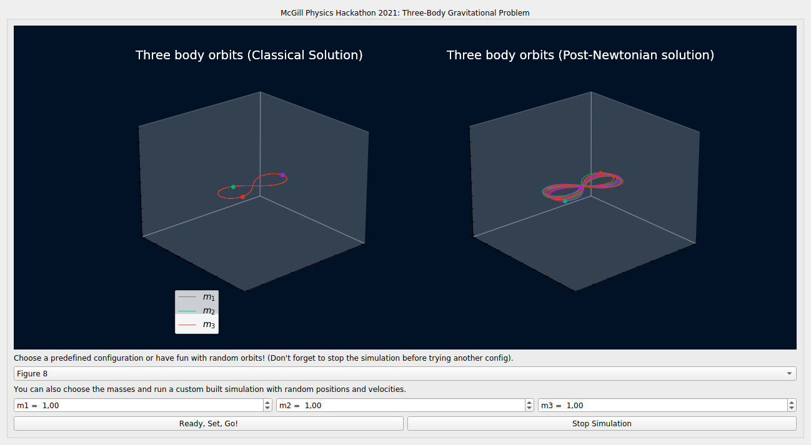

<h2> Prerequisites </h2>

 To run our simulator you need a couple of prerequisites (matplotlib, scipy, PyQt5, numpy). The best way to install them is by using pip (if you do not have pip installed on your computer, take a look at <a target="_blank" href="https://pip.pypa.io/en/stable/installation/">this link</a>) via the command
  
  <ul>
  <li> pip install matplotlib scipy pyqt5 numpy </li>
    
</ul>
or
<ul>
    <li> pip3 install matplotlib scipy pyqt5 numpy </li>
    </ul>
  

If you have both python2 and python3 on your personal machine.
After installing the prerequisites, you only need to download our main code from the github repository via 

<ul>
    <li> git clone https://github.com/mcgillblackhole/mcgillblackhole.github.io/tree/master/sourcecode </li>
    </ul>

enter the directory, and run the main code via "python black_hole_images.py".
<h2>Manual of our simulator </h2>

 We've made one interactive window so that you can focus primarily on the physics of the problem. You can select one of our preconfigured initial conditions, or give your own input, selecting different values for the mass of the black hole, the impact parameter of the incoming photons, the coordinates and angle from where the photons are coming from. The code takes up to 30 seconds to solve all the equations, and you can watch the simulation until the end, or select "Stop simulation" to test other configurations. 

 In the main pannel you'll be able to see an image representing the geodesics of photon(s) given the configuration(s) you chose, and a simulated picture of the black hole. 

  

<h3>This Homepage</h3>

@2022 
  This website was done by <a href="https://github.com/Igorreis">Igor Reis</a>, <a href="https://github.com/PedroHPCintra">Pedro Cintra</a>,  <a href="https://github.com/FeradoFogo">Felipe Fontinele</a>, <a href="https://github.com/Ranier137">Ranier Menote</a> and <a href="https://github.com/vitordmeireles">Vitor Dantas</a> for McGill Physics Hackathon 2021. The website is based on the <a href="https://github.com/barryclark/jekyll-now">Jekyll Now</a> blog template (available under the <a href="https://opensource.org/licenses/MIT">MIT Licence</a>), by <a href="https://github.com/barryclark">Barry Clark</a>.

