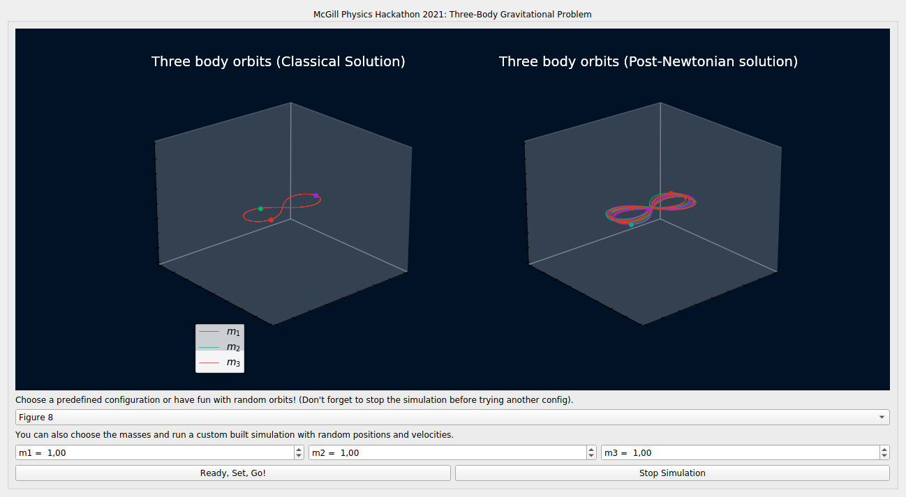

<h2> Prerequisites </h2>

 To run our simulator you need a couple of prerequisites (matplotlib, scipy, PyQt5, numpy). The best way to install them is by using pip (if you do not have pip installed on your computer, take a look at <a target="_blank" href="https://pip.pypa.io/en/stable/installation/">this link</a>) via the command
  
  <ul>
  <li> pip install matplotlib scipy pyqt5 numpy </li>
    
</ul>
or
<ul>
    <li> pip3 install matplotlib scipy pyqt5 numpy </li>
    </ul>
  

if you have both python2 and python3 on your personal machine.
After installing the prerequisites, you only need to download our main code from the github repository via 

<ul>
    <li> git clone https://github.com/mcgill3body/mcgill3body.github.io/tree/master/sourcecode </li>
    </ul>

enter the directory, and run the main code via "python 3_body_newton.py".
<h2>Manual of our simulator </h2>

 We've made one interactive window so that you can focus primarily on the physics of the problem. You can select one of our preconfigured orbits (from stable and famous
configurations such as the figure 8 to marginally stable (M) and unstable orbits (U)) in the first box of our panel. The code takes about 10-15 seconds to solve the differential equations and plot it on the main pannel.
You can then watch the simulation until the end, or select "Stop simulation" to test other configurations. 

 In the main pannel you'll be able to see the famous classical orbits obtained only from Newton's equations of gravity side-by-side with the orbits obtained
  with the relativistic corrections via the Einstein–Infeld–Hoffmann equations. The orbit plots aren't fixed in order to encourage exploring different points of view from the orbits:
 just click and drag the mouse around the orbits in each plot. 

 You can also have fun by selecting specific masses for each body and clicking the button "Ready, Set, Go!" to generate a randomized configuration (for position and velocity) with the choosen masses.

This isn't the end of the story! There are a plethora of orbits at reference 4 where you can explore our source code if you want to make adptations. 

  

<h3>This Homepage</h3>

@2021 
  This website was done by <a href="https://joaosds.github.io/">João Augusto</a>, <a href="https://github.com/PedroHPCintra">Pedro Cintra</a>,  <a href="https://github.com/FeradoFogo">Felipe Fontinele</a>, <a href="https://github.com/Igorreis">Igor Reis</a> and <a href="https://github.com/vitordmeireles">Vitor Dantas</a> for McGill Physics Hackathon 2021. The website is based on the <a href="https://github.com/barryclark/jekyll-now">Jekyll Now</a> blog template (available under the <a href="https://opensource.org/licenses/MIT">MIT Licence</a>), by <a href="https://github.com/barryclark">Barry Clark</a>.

